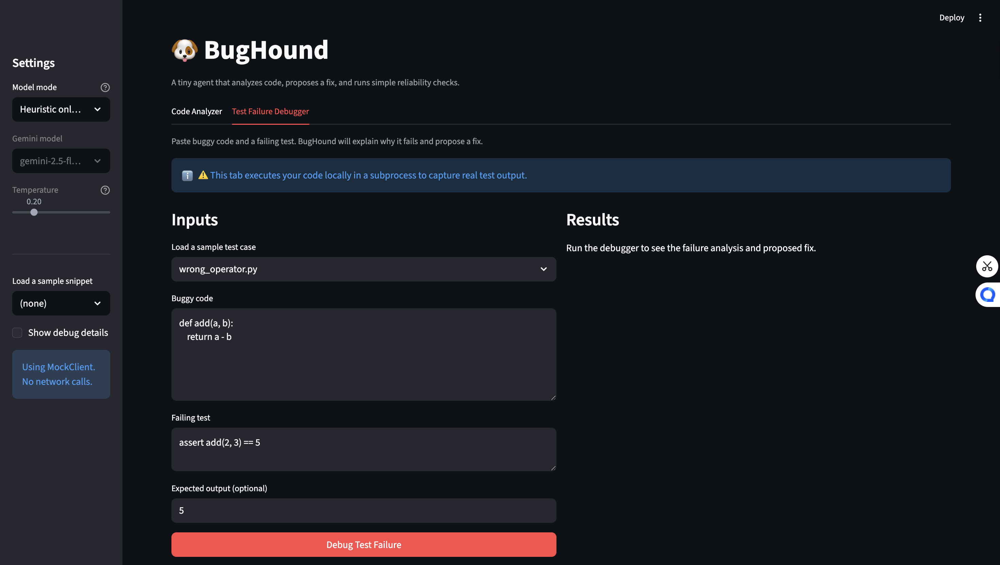
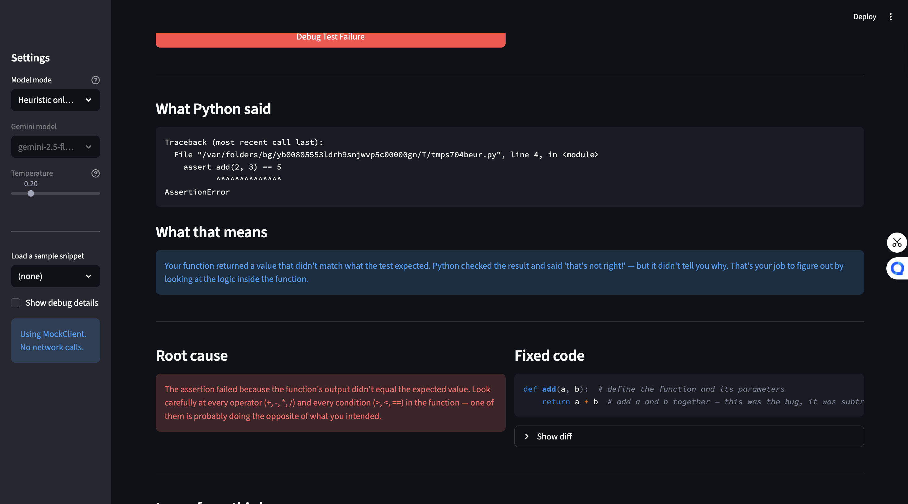
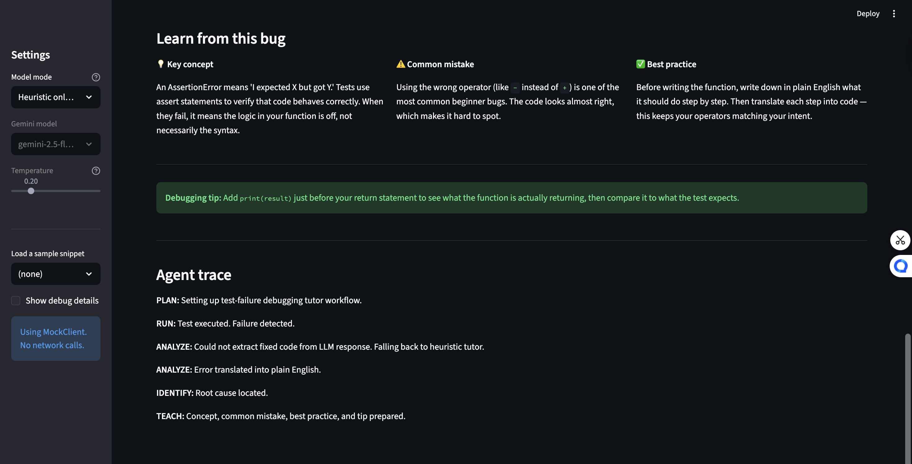

# BugHound — Agentic Python Debugging Assistant

BugHound is an AI-powered code review tool that analyzes Python snippets, proposes fixes,
and enforces reliability guardrails before deciding whether a fix is safe to apply automatically.
It was built as the Module 5 capstone for **AI110** at Howard University, extending my earlier
work from Modules 1–3.

---

## Demo

[Watch the walkthrough on Loom](https://www.loom.com/share/04d7bd0784ed4a78909fa6517800b561)

---

## Original Project (Modules 1–3)

> **Note:** Replace this section with your actual Module 1–3 project name and description.

**[Your Module 1–3 Project Name]**

My original project was a `[brief description, e.g., Python chatbot / code explainer / Q&A agent]`
that `[what it did — e.g., answered questions about uploaded code files using the Gemini API]`.
Its goals were `[original goals]`, and it demonstrated `[key capabilities]`. BugHound grew out
of that work by adding a structured agentic loop, explicit reliability scoring, and a human-in-the-loop
auto-fix gate that the earlier project lacked.

---

## Title and Summary

**BugHound** — an agentic debugging assistant with built-in reliability guardrails.

Given a short Python snippet, BugHound:

1. **Analyzes** code for anti-patterns and bugs (heuristics or Gemini)
2. **Proposes** a minimal, behavior-preserving fix
3. **Scores** the fix on a 0–100 risk scale
4. **Decides** whether to auto-apply or require human review

This matters because auto-applying a bad fix is worse than no fix at all. BugHound treats every
suggested change as *unverified by default* and forces the agent to justify its confidence before
writing anything — a pattern that shows up in production AI tooling at companies like GitHub Copilot
and Sourcegraph Cody.

---

## Architecture Overview


```
┌──────────────────────────────────────────────────────────┐
│                      BugHoundAgent                       │
│                                                          │
│  PLAN ──▶ ANALYZE ──▶ ACT ──▶ TEST ──▶ REFLECT          │
│             │           │       │                        │
│         Heuristic    Heuristic  assess_risk()            │
│         (offline) or (offline) (always local)            │
│         Gemini API  Gemini API                           │
└──────────────────────────────────────────────────────────┘
         │                              │
    llm_client.py                 risk_assessor.py
  GeminiClient / MockClient      score + level + reasons
```

**Key design choices:**

- The **ANALYZE** and **ACT** steps can use either Gemini or offline heuristics. If the API fails
  at any point, the agent silently falls back to heuristics and logs the reason.
- The **TEST** step (`assess_risk`) is *always local* — no LLM involved. This ensures the guardrail
  layer is deterministic, auditable, and cannot be "convinced" by a bad model response.
- The **REFLECT** step enforces a strict policy: auto-fix is only allowed when `risk.level == "low"`
  (score ≥ 75). Anything else goes to the human.
- The **Streamlit UI** (`bughound_app.py`) provides mode selection, a diff viewer, and step-by-step
  agent log display, but the entire agent logic is UI-independent and fully testable.

---

## Setup Instructions

### 1. Clone and enter the project

```bash
git clone <your-repo-url>
cd ai110-module5tinker-bughound-starter
```

### 2. Create and activate a virtual environment

```bash
python -m venv .venv
source .venv/bin/activate      # macOS / Linux
# or
.venv\Scripts\activate         # Windows
```

### 3. Install dependencies

```bash
pip install -r requirements.txt
```

### 4. (Optional) Add your Gemini API key

Only required for Gemini mode. The app works fully offline without it.

```bash
cp .env.example .env
# Then edit .env and set:
# GEMINI_API_KEY=your_key_here
```

### 5. Run the app

```bash
streamlit run bughound_app.py
```

Open [http://localhost:8501](http://localhost:8501) in your browser.

In the **sidebar**, choose:
- **Heuristic only (no API)** — works offline, no key needed
- **Gemini** — uses `gemini-2.5-flash` for richer analysis

### 6. Run tests

```bash
pytest
```

---

## Sample Interactions

**Main screen:**


**Analysis results:**


**Evaluation report:**


### Example 1 — Bare `except:` (Heuristic mode)

**Input** (`sample_code/flaky_try_except.py`):
```python
def load_text_file(path):
    try:
        f = open(path, "r")
        data = f.read()
        f.close()
    except:
        return None
    return data
```

**BugHound output:**

| Field | Value |
|---|---|
| Issue detected | `Reliability / High` — bare `except:` swallows all exceptions silently |
| Fix proposed | Replaced `except:` with `except Exception as e:` + added handler comment |
| Risk score | 50 / 100 — **medium** (bare except modified, verify correctness) |
| Auto-applied? | No — human review required |

The agent correctly flags this but does *not* auto-apply, because modifying exception handling
is structurally risky even when the direction is right. A human should confirm the right
exception type (e.g., `OSError`) before merging.

---

### Example 2 — Mixed issues (Heuristic mode)

**Input** (`sample_code/mixed_issues.py`):
```python
# TODO: Replace this with real input validation

def compute_ratio(x, y):
    print("computing ratio...")
    try:
        return x / y
    except:
        return 0
```

**BugHound output:**

| Field | Value |
|---|---|
| Issues detected | `Reliability / High` (bare except), `Code Quality / Low` (print), `Maintainability / Medium` (TODO) |
| Fix proposed | `except Exception as e:`, `print` → `logging.info`, `import logging` added |
| Risk score | 30 / 100 — **high** (−40 high severity, −5 bare except, −5 low severity) |
| Auto-applied? | No — all three deductions push score below the 75-point threshold |

This example shows the scoring stacking correctly: three separate issues compounding to a
high-risk verdict, keeping the human firmly in the loop.

---

### Example 3 — Clean code (no issues)

**Input** (`sample_code/cleanish.py`): a well-structured function with no anti-patterns.

**BugHound output:**

| Field | Value |
|---|---|
| Issues detected | None |
| Fix proposed | Original code returned unchanged |
| Risk score | 100 / 100 — **low** |
| Auto-applied? | Yes (no change = zero risk) |

Demonstrates that BugHound does not manufacture issues and correctly passes clean code through.

---

## Design Decisions

### Why a local risk assessor instead of asking the LLM to rate its own fix?

Letting an LLM grade its own output is circular — a model that produces a bad fix may also
rate it as safe. The risk assessor is a separate, deterministic function with no API dependency.
Its rules are explicit, testable, and can be audited in `reliability/risk_assessor.py` without
understanding any AI internals.

**Trade-off:** The rules are syntactic, not semantic. They can miss logic bugs (an off-by-one
error scores 100/100 if it doesn't change structure), and they can over-penalize good changes
(a correct refactor that shortens code loses 20 points for "much shorter than original"). We
accepted this in exchange for predictability.

### Why heuristic fallback instead of failing hard on API errors?

Reliability engineering principle: degrade gracefully. If the API is down or rate-limited, an
error message is worse than a best-effort heuristic result. The fallback is logged at every
step so the user always knows which path was taken.

**Trade-off:** Heuristics are less accurate. A user who sees a heuristic result may not notice
the log message and assume Gemini was used. The UI warns about this, but it can still mislead.

### Why Streamlit?

Fast iteration, no frontend boilerplate, easy diff display. For a course project and portfolio
piece the tradeoff (tightly coupled UI/logic if not careful) is acceptable. The agent code is
UI-independent by design — `BugHoundAgent.run()` takes a string and returns a dict.

---

## Testing Summary

### What the tests cover

```
tests/
├── test_agent_workflow.py   — shape validation, heuristic detection, LLM fallback
└── test_risk_assessor.py    — scoring rules, edge cases (empty fix, removed return)
```

All four workflow tests and four risk assessor tests pass offline with no API key required.
The `MockClient` class in `llm_client.py` returns intentionally invalid output to verify that
the fallback path triggers correctly and is logged.

### What worked

- The fallback chain (Gemini → heuristics) worked reliably; every API failure produced a
  valid heuristic result rather than a crash.
- The risk assessor scoring was deterministic and easy to unit-test because it is a pure function.
- The five-step log (`PLAN / ANALYZE / ACT / TEST / REFLECT`) made debugging agent runs
  straightforward — each step's reasoning is visible.

### What didn't work

- **Gemini over-rewrites:** In Gemini mode, the model sometimes rewrote the entire function
  when only one line needed changing. This caused structural-change penalties in the risk scorer
  and produced `medium` verdicts for fixes that were functionally correct.
- **Risk scorer false positives:** The "code is much shorter" rule (−20) fires on any concise
  refactor, including correct ones. A future fix would diff at the AST level rather than counting
  raw lines.
- **No semantic understanding in heuristics:** A function with a division-by-zero risk and no
  bare `except:` or `print()` gets a clean bill of health from the heuristic path.

### What I learned

Writing the risk assessor first — before testing Gemini — was the most important architectural
decision. It forced me to define "what does safe mean?" concretely before trusting any LLM output.
That lesson transfers: in any agentic system, the guardrail layer should be designed independently
of the model producing the output it guards.

---

## Reflection

Building BugHound taught me that **the hard part of AI systems is not the model call — it's
everything around it.** The Gemini call is three lines. The fallback handling, output parsing,
risk scoring, diff display, and test coverage are several hundred lines.

I also learned that LLMs are genuinely useful for the fuzzy parts of code review (naming,
missing edge cases, semantic bugs) but unreliable for the structural parts (minimal changes,
preserving behavior). Heuristics are the opposite. A real production tool would need both layers
working together — which is exactly what BugHound attempts, at small scale.

Most importantly: an agent that can modify code and decide to apply its own changes is a system
with real consequences. Every design decision in this project ultimately came back to one question:
*at what point do we trust this enough to act without a human?* The answer we landed on — only
when the fix is small, the issues are low-severity, and the structure is unchanged — is conservative,
and that conservatism is intentional.

---

## Project Structure

```
.
├── bughound_agent.py          # Core agent (PLAN → ANALYZE → ACT → TEST → REFLECT)
├── bughound_app.py            # Streamlit UI
├── llm_client.py              # GeminiClient + MockClient
├── reliability/
│   └── risk_assessor.py       # Deterministic risk scoring (no API)
├── sample_code/               # Example snippets for manual testing
├── tests/                     # pytest test suite
├── model_card.md              # Reflection on system behavior and failure modes
├── requirements.txt
└── .env.example
```

---

*Built by Ayotunde Ogunruku — AI110, Howard University*
